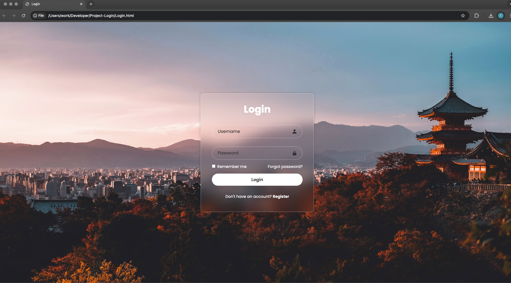

# Login Page Project

This is a simple and responsive login page built with HTML and CSS. The design features a blurred glass effect, background image, and modern styling elements. This project is part of my front-end learning journey.

## 🌐 Demo

(https://github.com/tarik-thomas/Login)

## 🚀 Features

- Responsive layout centered on the screen
- Blurred glass-style container with shadow
- Clean login form with input validation
- Custom icons using Boxicons
- Styled background using a photo I took in Japan

## 🛠️ Technologies Used

- HTML5
- CSS3 (Flexbox, custom styling)
- [Boxicons](https://boxicons.com/)
- Google Fonts (Poppins)

## 📁 File Structure

/project-folder/ │ ├── Login.html # Main HTML file ├── Login.css # Styling ├── Login.jpg # Background image └── README.md #

## 📸 Screenshot

## 📚 Learning Goals

- Practice structuring and styling a user interface
- Improve understanding of layout and design
- Prepare for deploying small front-end projects

## 🚧 Future Improvements

- Add JavaScript validation
- Create a functional register page
- Connect to backend for real login

## 📬 Contact

Tarik Thomas  
📧 tarik_thomas@hotmail.com
